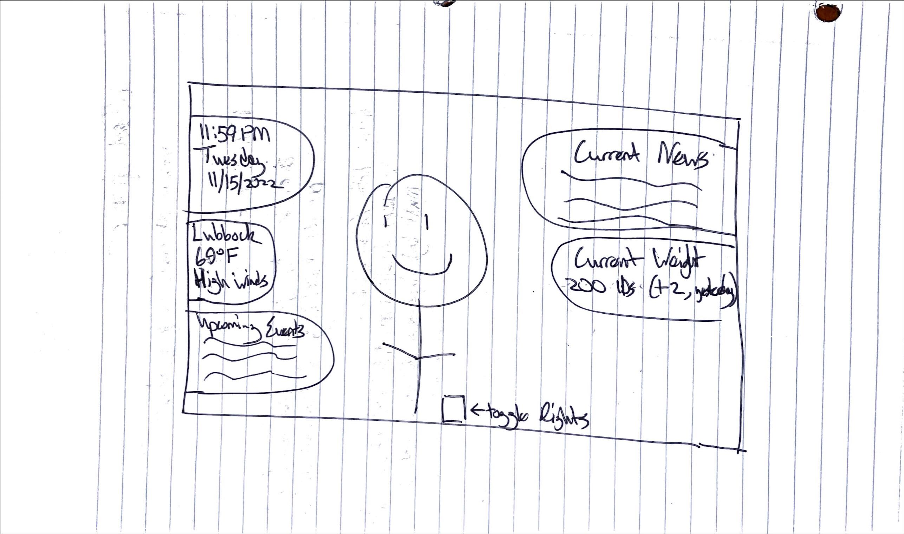

# p2.Chris.Brandt
CS 3366

### Links
[Presentation page](https://bchris24.github.io/p2.Chris.Brandt/) 

[GitHub repository](https://github.com/bchris24/p2.Chris.Brandt)

[Demo](https://bchris24.github.io/p2.chris.brandt/demo.html) 

[Video (optional)](https://www.youtube.com/) (e.g. https://www.youtube.com/embed/uilkmUoXoLU - embed link)

### C:

### B:
sdfsdf

### A:
sdfsf
